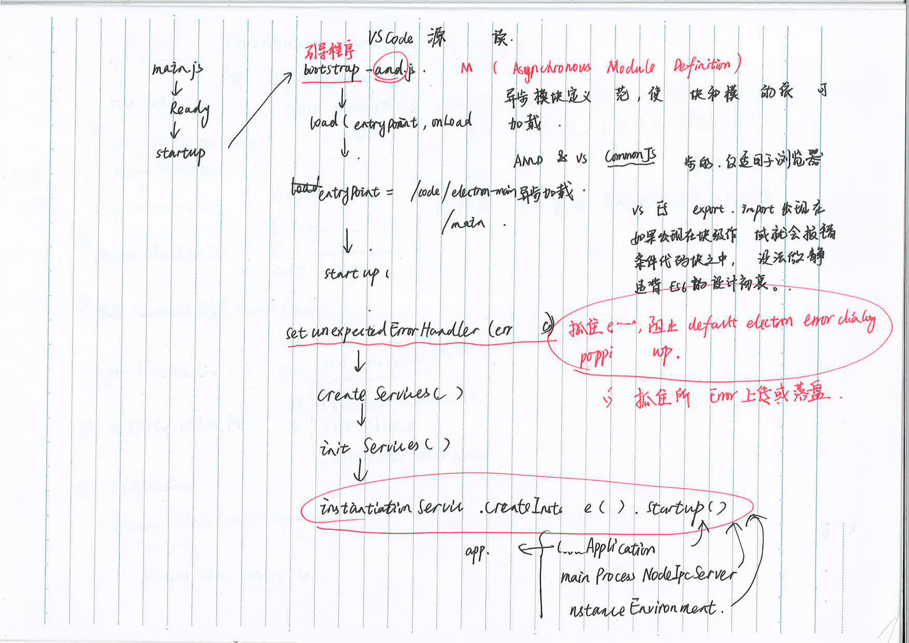
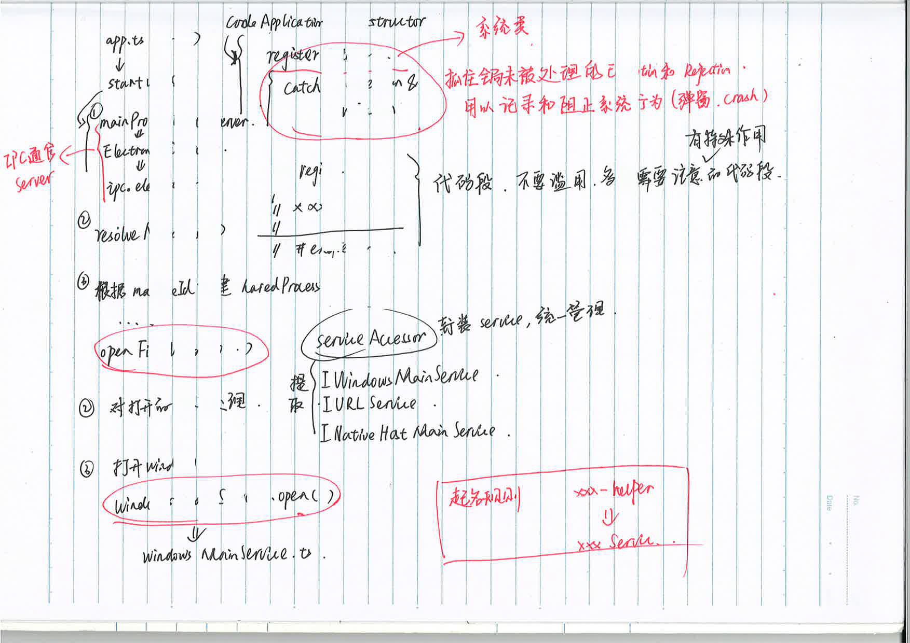

## 博文
* [VSCode技术揭秘](https://codeteenager.github.io/vscode-analysis/learn/)
* [VSCode源码分析](https://www.bookstack.cn/read/VSCode-sourcecode-analysis/chapter-2.md)
* [vscode source code analysis](https://www.programmersought.com/article/72602620991/)

## startup

* 启动到第一个窗体显示的流程



* 代码段，可以折叠

```
//#region

//#endregion
```

* 模块起名规则

之前代码里封装服务总是用helper后缀，但是模块其实不只是helper。看vscode代码，发现还是用server比较合适。
```
xxxHelper -> xxxServer
```

## bootstrap-amd.js

* [AMD](https://github.com/amdjs/amdjs-api/wiki/AMD-(%E4%B8%AD%E6%96%87%E7%89%88))
* [CommonJS、AMD、CMD、ES6 模块规范讲解](https://segmentfault.com/a/1190000022599809###)

## error
// base/common/errors.ts
* [笔记](./error.md)

## window
// windowsMainService.ts
